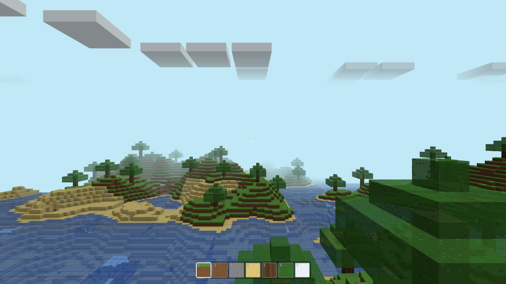
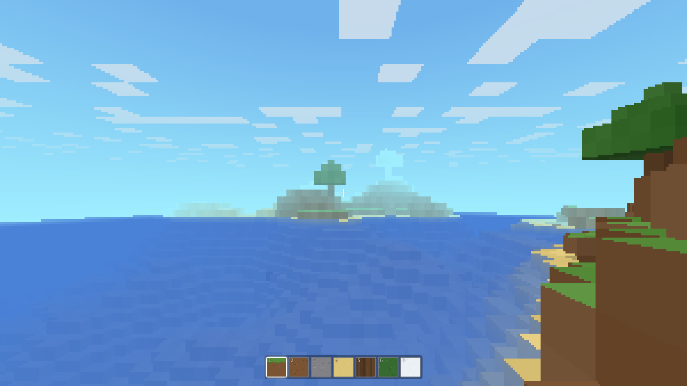
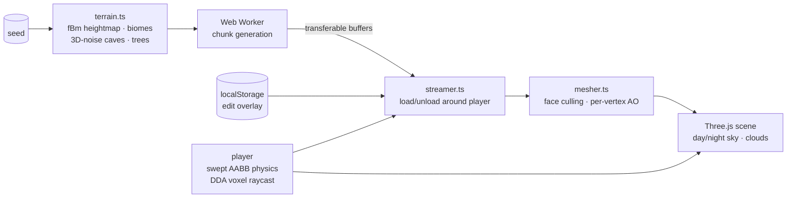

# minecraft-clone

> An infinite voxel world in your browser tab. No install, no assets, no
> server — every block, texture, and cloud is computed from one seed.

[](https://github.com/Vincent-P-essy/minecraft-clone/actions/workflows/ci.yml)
[](https://github.com/Vincent-P-essy/minecraft-clone/actions/workflows/pages.yml)
[](tsconfig.app.json)
[](LICENSE)

**▶ Play it now: [vincent-p-essy.github.io/minecraft-clone](https://vincent-p-essy.github.io/minecraft-clone/)**



_This screenshot is generated by the repo itself — `scripts/screenshot.mjs`
boots the real game in headless Chromium (SwiftShader software WebGL) and
captures what it renders._

A Minecraft-inspired voxel game built from scratch with Three.js and
TypeScript: procedurally generated infinite terrain with forests, deserts,
snowy peaks and cave systems, a full day/night cycle, and free block
building — with your edits persisted across reloads.

|                       |                                           |
| --------------------- | ----------------------------------------- |
| Move / jump / sprint  | `WASD` · `Space` · `Shift`                |
| Swim                  | `Space` in water (hop out at the surface) |
| Look                  | mouse (pointer lock — click to start)     |
| Break / place a block | left click (hold to repeat) / right click |
| Pick a block          | `1`-`9` or scroll wheel                   |
| Share your world      | add `?seed=<number>` to the URL           |

If your browser refuses pointer lock (some extensions and embedded contexts
block it silently), the game switches to **drag-to-look** on its own: drag
with the left button to look around, tap to break. And if your machine has
**no WebGL at all**, the game doesn't apologize — it switches to its own
**CPU raycaster** (one DDA ray per pixel on a 2D canvas, adaptive
resolution) and keeps playing:



_Same world, same physics, same controls — zero GPU. This mode exists
because a real player hit exactly that; their machine now runs the game at
30-40 fps in pure JavaScript._

## What's inside



- **Terrain is a pure function of (seed, world position).** Height, biome,
  cave carving, and even tree placement are all recomputable by any chunk
  independently — a canopy that leans across a chunk border gets identical
  blocks stamped from both sides without any chunk-to-chunk communication.
  That one design decision is what makes the world seamless _and_ the
  generator trivially parallelizable.
- **Generation runs in a Web Worker.** Block buffers come back as
  transferables (zero copy); the main thread only meshes, on a fixed
  per-frame budget, so walking into new terrain doesn't hitch.
- **The mesher bakes real ambient occlusion.** Per-vertex, the classic
  "0fps" formulation, with each quad's diagonal flipped toward the brighter
  vertex pair to kill the anisotropic dark-streak artifact. Combined with
  directional face shading, it's what makes a world with one light source
  read as _lit_ instead of flat.
- **Zero art assets.** The entire texture atlas (grass, sand, wood rings,
  bark, water...) is drawn onto a small canvas at startup with a seeded
  PRNG. The hotbar icons are cropped from the same canvas.
- **Physics never touches the renderer.** Movement is a pure per-axis swept
  AABB resolver over a `(x, y, z) => solid?` closure; block targeting is an
  Amanatides-Woo DDA raycast that visits every voxel boundary (a thin wall
  can't be skipped the way fixed-step sampling would). Both are unit-tested
  against synthetic terrain with no DOM or WebGL anywhere in sight.
- **Edits survive.** Broken and placed blocks are stored as a sparse
  overlay in `localStorage`, keyed by seed, and re-applied over freshly
  generated chunks — an explored world costs kilobytes, not megabytes.
- **Two renderers, one game.** The WebGL path draws meshed chunks with
  baked AO; the CPU path marches one ray per pixel straight through the
  block data (no meshes at all) with the same face shading, fog, water
  tint, clouds and day/night palette. Everything else — world, streaming,
  physics, interaction — is shared and renderer-blind.

## Development

```sh
npm ci
npm run dev          # local dev server
npm run test         # 204 offline tests (world, mesher, physics, raycast, streaming, sky)
npm run lint && npm run typecheck
npm run build        # production bundle
```

Everything interesting is testable without a browser: terrain determinism
and seam consistency, cave/ocean-floor invariants, mesher face counts and
AO levels and triangle winding, collision resolution, raycast face
detection, streaming load/unload/persistence round trips, day/night
continuity. CI runs the full gate on every push.

On top of that, `scripts/visual-check.mjs` boots the _built_ game in a
headless Chromium (SwiftShader software WebGL — works on GPU-less machines
and CI) and plays it: waits for the world to mesh, verifies the player
spawned on solid ground, engages pointer lock, places a block on a
neighboring column it picks by inspecting the world, breaks the block
underfoot, walks — then opens a second page with `requestPointerLock`
sabotaged to prove the drag-look fallback engages and stays fully playable
(move, look, tap-break), a third page with `getContext('webgl')` sabotaged
to prove the CPU raycaster boots, renders real terrain, moves and breaks —
and checks the console stayed clean. 18 end-to-end checks with
screenshots. It exists because unit tests can't see: the one real
rendering bug this project shipped (an atlas UV/`flipY` mismatch that made
grass sample an empty atlas region and leaves sample sand) was invisible
to every unit test and obvious in the harness's first screenshot.

```sh
npm run build && npx vite preview --port 4173 &
node scripts/visual-check.mjs                 # PASS/FAIL per check + screenshots
node scripts/screenshot.mjs                   # regenerates docs/screenshot.png
```

## Design decisions

- **Chunk-independent generation over chunk-to-chunk communication.** The
  usual alternative — generate a chunk, then patch neighbors when a tree
  overhangs — needs ordering, patch queues, and produces seams when it's
  wrong. Making every feature a pure function of world position deletes
  the whole problem class, at the cost of some redundant computation at
  borders (cheap, and it runs in a worker anyway).
- **Meshing on the main thread, generation off it.** Meshing needs
  neighbor-chunk reads and produces GPU-bound buffers; shipping all that
  state to a worker costs more than the ~1-2ms a chunk mesh takes. The
  expensive, state-free part (noise sampling) is what moves.
- **Reject-by-default physics steps.** The collision resolver assumes
  small per-frame displacements and clamps them axis-by-axis; velocities
  zero out on contact. Terminal velocity plus the per-axis sweep keeps
  even long falls from tunneling through a floor.
- **`localStorage` over a save-file format.** The overlay-over-regeneration
  model means persistence is a dictionary, not a world serializer.

## Limits

- No lighting propagation (torches, sunlight flood fill) — AO plus
  directional shading only. It's the single feature that would most change
  the look of caves, and the natural next step.
- The CPU renderer trades fidelity for universality: flat block colors
  with a per-voxel speckle instead of textures, no ambient occlusion, no
  block-outline highlight, ~50 blocks of view distance.
- Water supports swimming (buoyancy, swim up, hop onto the shore) but
  doesn't flow — breaking a dam doesn't flood anything.
- No mobs, crafting, or inventory beyond the hotbar — the scope is the
  world itself: generate, explore, dig, build.
- Chunk meshes rebuild whole-chunk on edit (~1-2ms); fine in practice,
  greedy meshing would shrink both that and draw calls further.

## License

[MIT](LICENSE) — © Vincent Plessy
